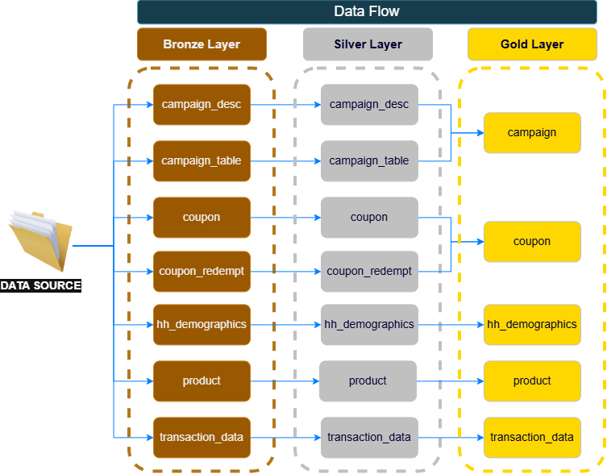
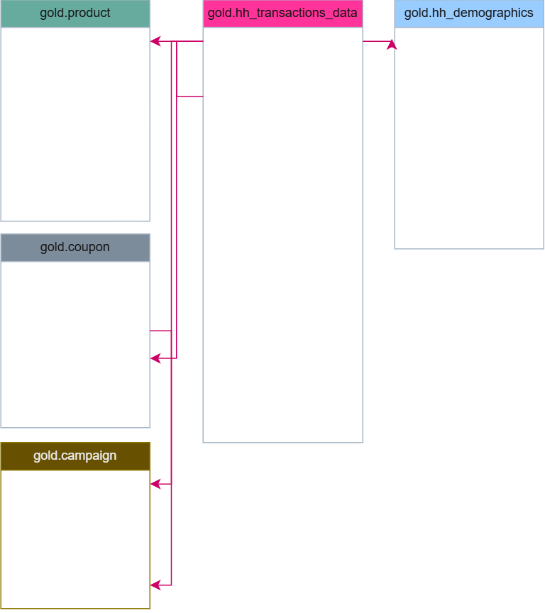

# Dunnhumby Retail Analytics

## Analytics Project

A retail analytics project using **The Complete Journey** dataset from Dunnhumby. The project is designed to demonstrate practical skills in **SQL Server, data engineering, exploratory data analysis, customer analytics, and business intelligence**.

---

## Project Overview

The objective of this project is to explore customer purchasing behavior and retail performance using transactional grocery data.

The analysis focuses on questions relevant to grocery and retail businesses, including:

- Overall business and sales performance
- Product and department performance
- Customer value and purchasing frequency
- Customer recency and engagement
- Basket size and basket value
- Product affinity and cross-selling opportunities
- Promotion and campaign effectiveness
- Customer segmentation

---

# Dataset

The project uses [Dunnhumby's The Complete Journey](https://www.dunnhumby.com/source-files/) dataset, which contains  real in-store household-level grocery transaction data together with product, campaign, coupon, and some demographic information.

The dataset provides an opportunity to analyze:

- Household purchasing behavior
- Products and departments
- Transactions and sales
- Discounts
- Coupons
- Campaigns
- Customer demographics

> **Note:** The source data is not included in this repository where licensing/distribution restrictions apply. Instructions for obtaining the dataset are provided separately.

---

# Tools
### Data Engineering & Database

- **Microsoft SQL Server**
- **T-SQL**
- Data cleaning and validation

### Analytics

- SQL aggregations
- CTEs
- Subqueries
- Window functions
- Ranking
- Customer segmentation
- Time-series analysis
- Basket analysis


# Data Architecture

The project follows a simplified **Medallion Architecture**.





---

# Exploratory Data Analysis

The current analysis is organized around several business areas.  script includes all relevant questions and codes.

---


# Repository Structure

```
dunnhumby-retail-analytics/
│
├── README.md
│
├── data/
│   └── README.md
│
├── sql_scripts/
│   ├── bronze_layer/
|   |   ├── bronze_load.sql/
|   |   ├── ddl_bronze.sql/
│   ├── silver_layer/
|   |   ├── silver_load.sql/
|   |   ├── ddl_silver.sql/
│   ├── gold_layer/
|   |   ├── gold_load.sql/
│   ├── data_analyses.sql/
│   |── init_database.sql/
|   └── quality_checks.sql/
│
└──  assets/
│   ├── data_catalog.md
│   ├── data_model.png
│   └── data_flow.png
```

---

# Business Value

The purpose of the analysis is not only to calculate descriptive statistics, but to translate transactional data into insights that could support retail decision-making.

Potential applications include:

- Identifying high-value customer segments
- Understanding customer purchasing behavior
- Improving product assortment
- Identifying cross-selling opportunities
- Evaluating promotional strategies
- Understanding customer engagement
- Identifying changes in purchasing behavior
- Supporting targeted marketing decisions

---